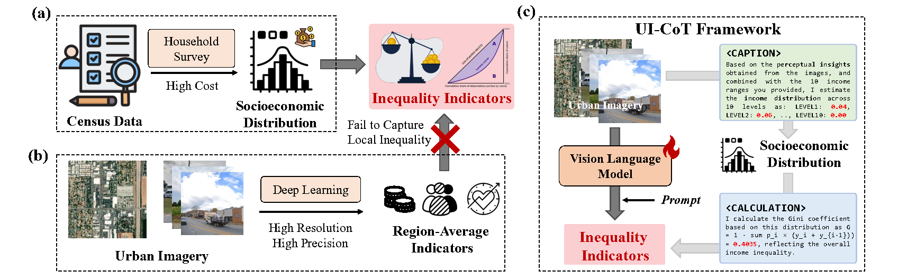

# UI-CoT

---
This is the implementation of [WWW'25 paper](https://dl.acm.org/doi/10.1145/3696410.3714536) Perceiving Urban Inequality from Imagery Using Visual Language Models with Chain-of-Thought Reasoning.

## Citation
If you use this code in your project or find our project interesting, please consider citing the following paper:
```bibtex
@inproceedings{zhang_2025_perceiving,
author = {Zhang, Yunke and Ma, Ruolong and Zhang, Xin and Li, Yong},
title = {Perceiving Urban Inequality from Imagery Using Visual Language Models with Chain-of-Thought Reasoning},
year = {2025},
isbn = {9798400712746},
publisher = {Association for Computing Machinery},
address = {New York, NY, USA},
url = {https://doi.org/10.1145/3696410.3714536},
doi = {10.1145/3696410.3714536},
booktitle = {Proceedings of the ACM on Web Conference 2025},
pages = {5342–5351},
numpages = {10},
keywords = {chain of thoughts, urban inequality, urban sustainability, vision language model},
location = {Sydney NSW, Australia},
series = {WWW '25}
}
```
